# Proyecto intermodular DAW 🐱


## 4 Despliegue en internet
# Despliegue

## A - Mi dominio.  

He decidio que el dominio seria scats.es, puesto que el proyecto tiene como nombre StreetCats, es facil de recordar y escribir ademas de una extension española.

<hr>

## B - Despliegue en local


<hr>

## C - Despliegue en internet🐾

 Vamos a aprovisionar una instancia del Amazon EC2 en AWS Academy.  
 Empezamos creando la instancia y conectandola.  
 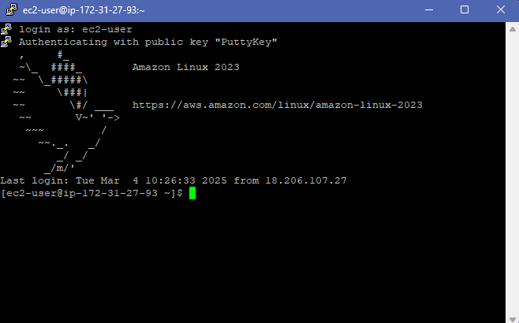  
 Aqui vemos la instancia conectada y las claves.  
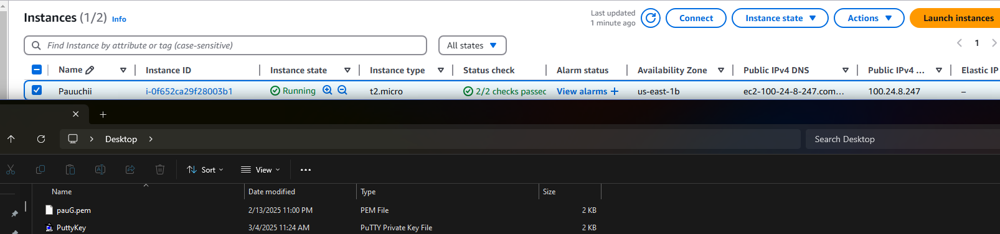  

<hr>

### Vamos a asignar una IP elastica a una estancia EC2 en AWS

Vamos a navegar a el apartado **EC** a la izquierda y seguiremos las marcas purpuras.
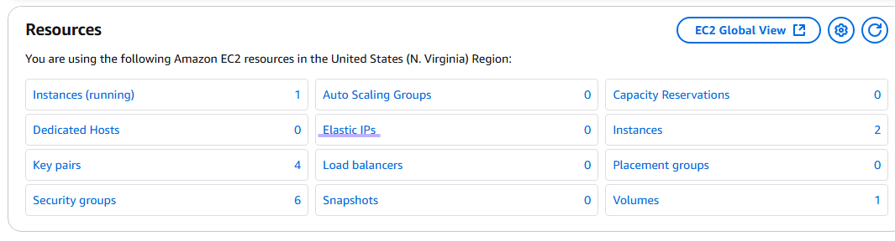
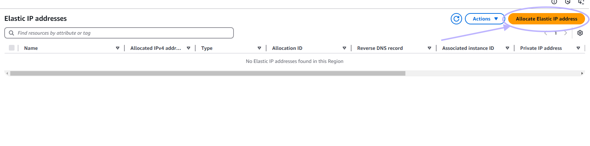
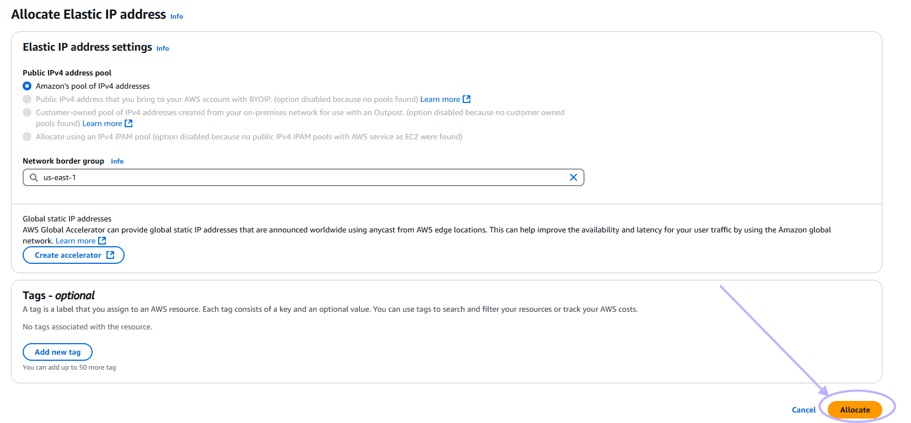
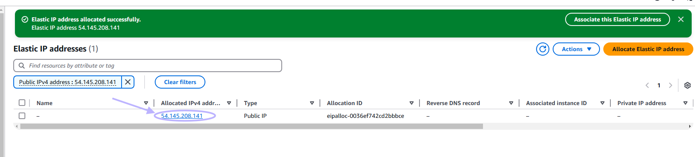
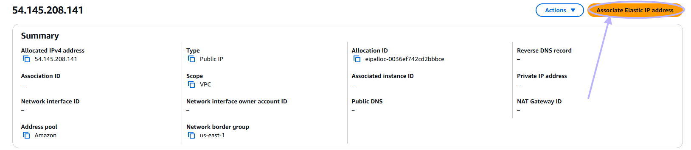
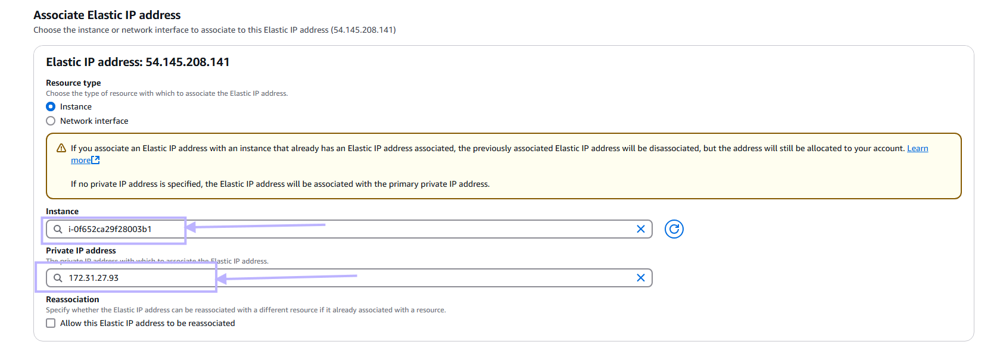
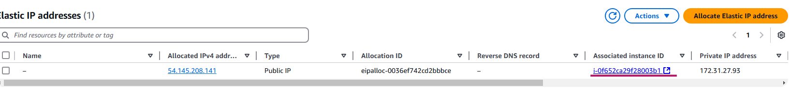  
En esta ultima imagen ya podemos ver la instancia con la ip elastica, deberia tener la ip en la seccion de DNS.
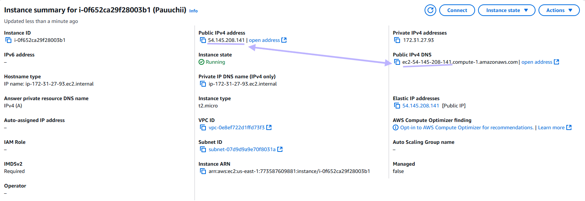

<hr>

### Conectaremos con ssh, via terminal  

* Vamos a empezar usando ssh 🐱  
  
  Vamos a recordar que en mi caso la instancia que servira apache sera [98.85.89.85] y la maquina slave o servidor para backend sera [3.86.78.176] las dos utilizando ip elastica.   
  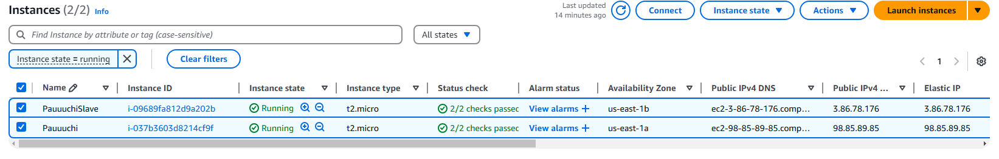
  Ahora haremos la conexion con la primera maquina;  
  ```console
     ssh -i .\VisualKeys.pem ubuntu@ec2-98-85-89-85.compute-1.amazonaws.com
    ```
    Y para la siguiente seria lo mismo sustituyendo el dns tras la @:
    ```console
     ssh -i .\VisualKeys.pem ubuntu@ec2-3-86-78-176.compute-1.amazonaws.com
    ```
    - Para ayudarnos un poco con ese lio de ips, podemos crear un profile en windows y un .sh en linux.

<hr>

###  Ahora realizaremos un scp para copiar archivos entre anfitrion y maquina remota  

  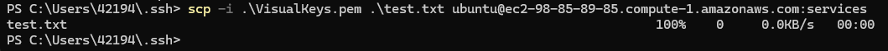

